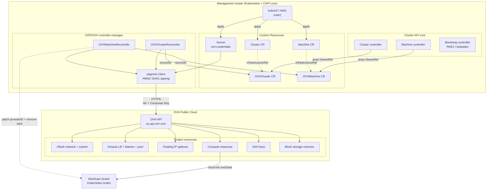
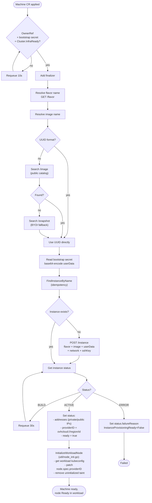
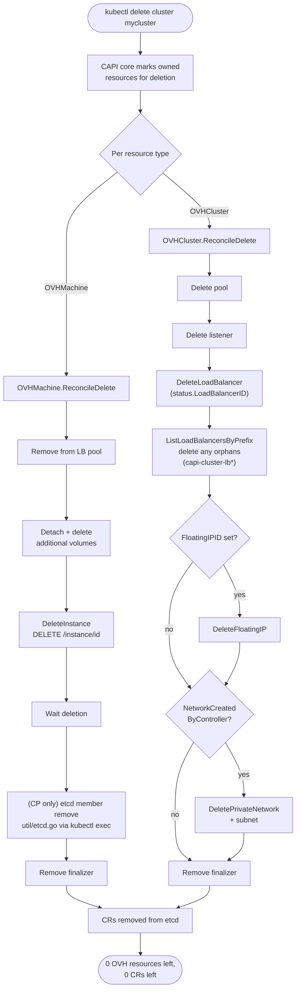

# Architecture

cluster-api-provider-ovhcloud is a [Cluster API](https://cluster-api.sigs.k8s.io/)
infrastructure provider that lets you declare Kubernetes clusters on
OVH Public Cloud as native Kubernetes resources.

## Component overview

## CRDs

| CRD | Scope | Purpose |
|-----|-------|---------|
| `OVHCluster` | Namespaced | One per CAPI Cluster. Holds OVH project ID, region, network config, LB config. The reconciler creates the private network (or uses an existing one), the Octavia LB, listener, pool, and optionally the floating IP. |
| `OVHMachine` | Namespaced | One per CAPI Machine. Specifies flavor, image (public OVH catalog or BYOI snapshot), SSH key, optional volumes. The reconciler creates an OVH instance with the bootstrap data injected as cloud-init userData. |
| `OVHMachineTemplate` | Namespaced | Template referenced by KubeadmControlPlane / RKE2ControlPlane / MachineDeployment. Creates `OVHMachine` resources from a spec. |
| `OVHClusterTemplate` | Namespaced | Template referenced by ClusterClass. Creates `OVHCluster` from a spec for topology-based clusters. |

## Reconciliation flows

### OVHCluster reconcile loop

```mermaid
flowchart TD
  START([Cluster CR applied]) --> WAIT_OWNER{OwnerRef from<br/>Cluster ctrl?}
  WAIT_OWNER -- no --> RETRY1[Requeue 30s]
  RETRY1 --> WAIT_OWNER
  WAIT_OWNER -- yes --> FIN[Add finalizer]
  FIN --> CREDS["ValidateCredentials<br/>GET /cloud/project/{sn}/region"]
  CREDS --> COND_CRED[Set OVHConnectionReady=True]

  COND_CRED --> NETID{status.NetworkID<br/>set?}
  NETID -- no --> CREATE_NET["CreatePrivateNetwork<br/>POST /network/private"]
  CREATE_NET --> NET_OK
  NETID -- yes --> NET_OK[Get network detail]

  NET_OK --> REGION_ACTIVE{Network ACTIVE<br/>in region?}
  REGION_ACTIVE -- no --> RETRY2["Requeue 30s<br/>(errNetworkNotReady)"]
  RETRY2 --> NET_OK
  REGION_ACTIVE -- yes --> SUBNET{Subnet exists?}

  SUBNET -- no --> CREATE_SUBNET["CreateSubnet<br/>(start/end IPs)"]
  CREATE_SUBNET --> COND_NET[Set NetworkReady=True]
  SUBNET -- yes --> COND_NET

  COND_NET --> LB_FIND["Find LB by name<br/>(idempotency check)"]
  LB_FIND --> LB_EXISTS{LB exists?}
  LB_EXISTS -- no --> LB_FLAVOR[Resolve LB flavor]
  LB_FLAVOR --> LB_OSNET[Resolve OpenStack<br/>network UUID]
  LB_OSNET --> LB_POST["POST /loadbalancer<br/>(returns task ID)"]
  LB_POST --> LB_POLL[Poll find-by-name<br/>up to 110s]
  LB_POLL --> LB_GET
  LB_EXISTS -- yes --> LB_GET[Get LB detail]

  LB_GET --> LB_STATUS{LB ACTIVE?}
  LB_STATUS -- no --> RETRY3[Requeue 30s]
  RETRY3 --> LB_GET
  LB_STATUS -- yes --> LISTENER[Create listener<br/>port 6443 TCP]
  LISTENER --> POOL[Create pool<br/>roundRobin]

  POOL --> FIP_CHECK{floatingNetworkID<br/>set?}
  FIP_CHECK -- yes --> CREATE_FIP[CreateFloatingIP<br/>+ AssociateToLB]
  CREATE_FIP --> ENDPOINT[Set controlPlaneEndpoint<br/>= floating IP]
  FIP_CHECK -- no --> ENDPOINT_VIP[Set controlPlaneEndpoint<br/>= LB VIP]

  ENDPOINT --> READY[status.ready=true<br/>InfrastructureReady=True]
  ENDPOINT_VIP --> READY
  READY --> END([Cluster ready for Machines])
```

### OVHMachine reconcile loop

### Deletion flow (cluster + machines)

Both reconcilers honour the standard CAPI finalizer pattern: when the CR
is marked for deletion, the controller drives an explicit cleanup before
removing the finalizer and letting Kubernetes garbage-collect the CR.

The orphan-LB cleanup defends against duplicate LBs created by previous
reconciles (e.g. before the idempotency fix in v0.1.0 landed) or by a
controller crash between the POST and the status persist.

## Conditions

The provider exposes the following conditions on its CRs to make state
inspection easy via `kubectl get ovhcluster -o yaml`:

### OVHCluster

| Type | True meaning |
|------|--------------|
| `OVHConnectionReady` | Credentials validated against the OVH API |
| `NetworkReady` | Private network + subnet exist and are ACTIVE |
| `NetworkCreatedByController` | This network was created by the controller (not a pre-existing one) |
| `LoadBalancerReady` | LB is ACTIVE with VIP, listener and pool created |
| `InfrastructureReady` | All cluster-level infrastructure is ready, controlPlaneEndpoint is set |

### OVHMachine

| Type | True meaning |
|------|--------------|
| `InstanceCreated` | POST /instance succeeded |
| `InstanceProvisioningReady` | Instance reached ACTIVE state |
| `InstanceRunning` | Instance is in ACTIVE state |

## OVH API specifics

The `pkg/ovh` package wraps the
[OVH Go SDK](https://github.com/ovh/go-ovh) with several adapters specific
to the OVH Cloud API behaviour:

1. **Async POSTs**: Octavia LB creation returns a task descriptor, not the
   LB. The client polls list-by-name with backoff after POST.
2. **Idempotency**: LB creation first lists by name and skips POST if a match
   exists. Prevents duplicates if the controller restarts mid-create.
3. **OpenStack UUIDs**: region-scoped APIs (Octavia) want the OpenStack
   network UUID, not the OVH `pn-XXXNNN_N` ID. The client resolves this via
   `PrivateNetwork.OpenStackIDForRegion()`.
4. **Status casing**: OVH returns lowercase status (`active`, `online`),
   not the OpenStack-standard uppercase. Constants are lowercase.
5. **Schema quirks**: Listener uses `port` (not `protocolPort`) and
   `loadbalancerId` (lowercase 'b'); Pool uses `algorithm` (not
   `lbAlgorithm`) with camelCase values (`roundRobin`, not `ROUND_ROBIN`);
   Member API takes a batch under `{members: [...]}`.
6. **BYOI images**: Custom images uploaded via Glance appear under
   `/snapshot`, not `/image`. `GetImageByName` searches both transparently.

These are codified in `pkg/ovh/types.go` and `pkg/ovh/client.go` so users
of the provider don't have to know about them.

## Why no Cloud Controller Manager?

OVH does not ship a managed Kubernetes cloud-controller-manager (CCM)
with a `--cloud-provider=ovh` flavor. To still get correct
`Node.spec.providerID` and clean up the `node.cloudprovider.kubernetes.io/uninitialized`
taint, the CAPIOVH machine controller uses
`util.InitializeWorkloadNode()`: from the management cluster, after the
OVH instance is ACTIVE and the workload node has joined the workload
cluster, it sets `providerID` and removes the taint via the Kubernetes API.

This bypasses the chicken-and-egg problem where the `cloud-provider=external`
taint blocks CNI scheduling, which would otherwise prevent the workload
node from becoming Ready.

## Why not use Cluster API Provider OpenStack (CAPO)?

OVH Public Cloud is OpenStack-based and CAPO supports OpenStack. We
considered it but went with a native OVH provider because:

1. OVH-native scoped credentials (Application Key + Consumer Key) are
   safer than full OpenStack project credentials (which give Cinder, Glance
   and Heat access by default).
2. OVH-specific quirks (async LB POST, casing, snapshot-as-BYOI) are
   easier to handle directly than to work around in CAPO.
3. OVH-only features (vRack, OVH-managed LB flavors, future OVH-DNS
   integration) are first-class citizens.

## Memory and persistence

The controller is stateless. All state is in:

- The `OVHCluster.status` and `OVHMachine.status` fields (resource IDs,
  conditions, addresses)
- The `Cluster.spec.controlPlaneEndpoint` (set by the cluster controller
  once the LB has a VIP)
- Finalizers on both CRs (ensures cleanup runs before the resource is
  removed from etcd)

Restarting the controller is safe: the next reconciliation re-reads the
OVH state via list-by-name and resumes where it left off.
